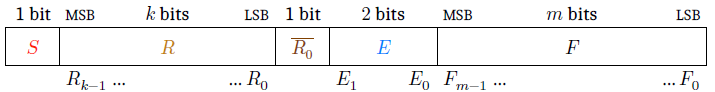

## Posit Library for Arduino

This is an C/C++ library for posit8 and posit16 tapered/floating point arithmetic support in Arduino.

[Posit Arithmetic](https://posithub.org/docs/Posits4.pdf) was invented by John Gustafson. It is an alternative format to IEEE 754 that promises a more efficient and balanced precision, especially useful for AI.
Posits can be any size from 2 to 32 bits or even more. Only 8-bit and 16-bit are considered in this library, and only the ATmega368 architecture is targeted (UNO etc.), since 32-bit architectures (ESP32, RP2040 etc.) often have hardware acceleration for IEEE 754 floats.

No code was copied from any existing work, but some inspiration came from the [SoftPosit C reference library](https://gitlab.com/cerlane/SoftPosit), from section IV of the https://arxiv.org/pdf/2308.03425 paper (on division algorithms and rounding, leading to the conclusion that *rounding to nearest even* is not likely worth pursuing on Arduino), and from many other pages on the Internet (Quora, Stack Overflow, etc.).

The [WokWi](https://wokwi.com/projects/407404859992419329) simulator was extensively used for the development of this library, as it reacts much faster to code changes than the Arduino software.

Any number representation system using N bits can represent exactly 2^n values. All other numbers have to be rounded (up or down). While IEEE 754 numbers have fixed sizes for exponent (power of two) and mantissa (fractional part), hence can [always](https://arxiv.org/pdf/1811.01721) express 2^mantissa values between any successive powers of two, such as between 1 and 2, or between -1/64 and -1/32, posits have a variable length exponent, so they can exactly express more values around +/-1, where more calculations typically take place, and are less precise for very big or very small numbers (like 4096 or 1E-6). 
The [Posit Standard](https://posithub.org/docs/posit_standard-2.pdf) was released in 2022 and defines the storage format, operation behavior and required mathematical functions for Posits. 
It differs in some design choices from previous publications on posit arithmetic, and is only partially covered here, since not all decisions are equally applicable to the Arduino environment.

### Status 
This library is a work in progress, and my first experience in creating an Arduino library _and_ publishing on GitHub, so expect errors and mistakes, stupid or not, and don't hesitate to contribute and propose correction and ameliorations. I tried to follow the [official guide](https://docs.arduino.cc/learn/contributions/). 
As with all WIP, expect many, frequent and breaking changes. Remember this is also a way for me to learn.

Today, the library allows to create posit8 (both with 0, 1, and 2-bits exponent field) and posit16,2 objects from raw unsigned byte/uint, from int (16 bits), float32 and double (also 32 bits on Arduino platform), to convert a posit back to float, to add, subtract, multiply and divide two posits, and to calculate prior/next and square root of posits. 

Planned in coming iterations : comparisons with overloading of operators, refactoring ...
Maybe a better way to round operations will sneak in if it doesn't break the simplicity rule. Basic trigonometry functions will also be considered.

## Some explanations on Floats and Posits.
### IEEE 754 float representation
The standard Arduino math library supports [several functions](https://www.tutorialspoint.com/arduino/arduino_math_library.htm), but only one type of floating point numbers : 32-bit IEEE 754. This is the most common standard for floating point calculations, described in many projects such as [Mimosa](https://www.mimosa.org/ieee-floating-point-format/). That format consists of a one-bit sign (like signed integers), a 8-bits exponent (power of two, biased by adding 127), and a 24-bits mantissa (with the starting "1" bit uncoded). There is no inversion of bits (2's complement) for negative numbers like for signed integers.

Expressing -10.5 in float requires the following steps :
1. coding the absolute value in binary (1010.1)
2. finding the power of 2 (3) and add 127 (total 130)
3. coding the sign, the exponent and the mantissa

Hence the 32-bit float representation of -10.5 is 0b1***100 0001 0***010 1000 0000 0000 0000 0000 (with exponent bits bold and italicized). 

Funny enough many simple reals cannot be expressed exactly. For example 0.1 is rounded to 0b0 0***011 1101 1***100 1100 1100 1100 1100 1101 (positive, power -4, mantissa 1.6000000238418579), or 0,1000000014901161. IEEE 754 also allocates several values for exceptions such as +/- infinity (exponent 255, mantissa all zeros), two different zeros (+0 is all zeros and -0 is 1 followed by all zeros), subnormal (very small) numbers, and different representations of Not a Number (NAN).

### Posit float representation
The major invention in the posit format was to add one additional variable-length field (called "regime") between the sign and the exponent fields. All regime bits are equal, and the first different bit marks the end of the regime field. The (fixed) size of the exponent bits field ("E" in the picture, also called "es" bits) used to be an externally defined parameter. This means there were multiple, incompatible versions of posits, depending on the es parameter. To remove that caveat, the posit standard imposes es=2 for all sizes. However, this library supports both Posit8,0 (no exponent field), posit 8,1 and Posit8,2.

 
Fig.1 : General Posit Format (from Posit Standard(2022))

Precision extension (for example from 8 to 16 bits) can be done simply by adding zeros at the end, expressing the very same numbers. Posit arithmetic implies that there is never underflow or overflow, only "rounding errors". 
For example, in posit8,2 arithmetic, 1024+224 is ... 1024 and there are no values to express numbers between 16384 and 32768. 
There are also as many numbers bigger than one than between zero and one.

Examples of [tiny posit sizes vizualisations](https://github.com/stillwater-sc/universal/blob/main/docs/posit-refinement-viz.md) make it easier to understand the concept: since a posit2 number has 2 bits, it can obviously only express exactly a set of 4 values. These are zero, one, minus one, and infinity (Not a Real, or NaR). Each time one bit is added, one value is inserted between each value already in the set. So a 3-bit posit will be able to express exactly the same four values, but also four new values : +/-2 and +/-0.5 if es=0, or +/-16 and +/-1/16 if es=2. Posit4,0 adds positive and negative values 1/4, 3/4, 3/2 and 4, and so on. An [interactive visualisation project](https://cse512-19s.github.io/FP-Well-Rounded/) shows you all possibilities for Posits up to 8 bits. You can also find [tables](https://github.com/stillwater-sc/universal/tree/main/docs/tables) of all supported values for several sizes and exponents.

The exponent field, between the regime and the mantissa, extends the limits of expressiveness, to the detriment of precision : posit3,1 numbers express exactly 4 and 0.25 instead of 2 and 0.5. Similarly, posit4,1 can express 0, 1/16, 1/4, 1/2, 1, 2, 4, 16 and infinity (and the corresponding negatives). Most often the numbers expressed above one and below one are reciprocal (their product is one), but this isn't true for values with mantissa bits : the reciprocal of 1.5 is 2/3=0.6666... while the posit number is 0.75 (3/4).

### (Assumed) deviations from the standard
The main purpose of this library is to provide a more efficient alternative to the existing float arithmetic on constrained microcontrollers (ATmega328) and maybe to improve the notoriety of posits. 
This has several implications :
- Support of 32-bit posits is not considered, because the increased precision (vs. float32) is a non-objective, and float64 doesn't exist in Arduino.
- The absence of overflow is a positive aspect of posits. However, underflow to zero is likely desirable for IoT applications etc. Hence the library allows to round down posits smaller than 1E-6 (1ppm) to zero by default for Posit8, and its square (1E-12) for Posit16. This is optional, and parametrizable by defining ESPILON in your sketch before including the library.
- Rounding towards zero is preferred to "Rounding to nearest even" because it comes with much lower complexity (no guard/round/sticky bits to process). Beware that this means that 64.0 - 0.5 = 32.0. This could be revised in the future.
